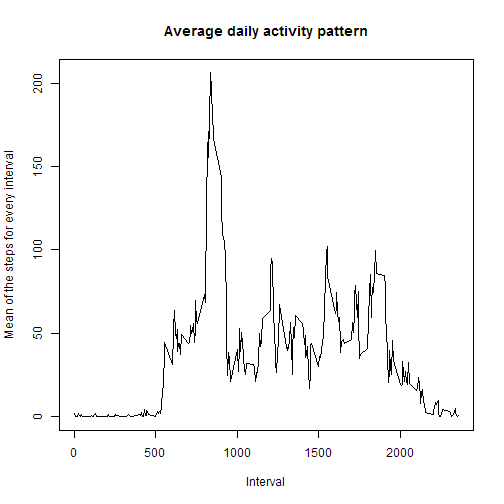
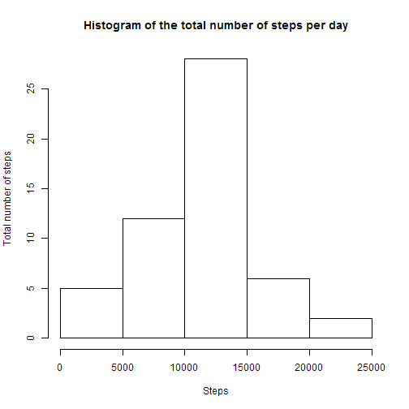
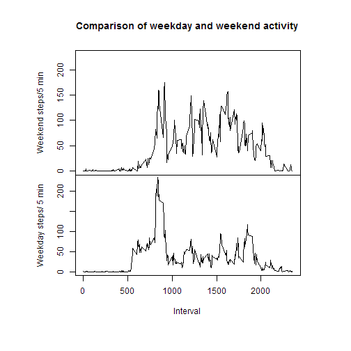

# Reproducible Research: Peer Assessment 1

---
*Dear Reviewer,*

*thank you for taking your time to review my code. Hope you had fun and success with your assignment and good luck for the rest of the course.*


Load dplyr package for data pre-processing. Please install if necessary:

```r
library(dplyr)
```

## Loading and preprocessing the data
Data is read in (please make sure that activity.csv is in your working directory) and the date is converted to "real" dates:

```r
activity <-read.csv("activity.csv")
activity [,2] <- as.Date(activity[,2])
```


## What is mean total number of steps taken per day?
Data is grouped by date and the sum of each day is stored in a new column labeled as "sum": 

```r
table.date <- activity %>% group_by(date) %>% summarise(sum=sum(steps)) 

mean(table.date$sum, na.rm=TRUE)
```

```
## [1] 10766.19
```

```r
median(table.date$sum, na.rm=TRUE)
```

```
## [1] 10765
```
**Mean and median are very close to each other, which usually is a hint of a symetric (unskewed) distribution.**


## What is the average daily activity pattern?
Data is grouped by interval and the mean is added as a new column to the data:

```r
table.interval <- activity %>% group_by(interval) %>% summarise(mean=mean(steps, na.rm=TRUE))
plot(table.interval, type="l",xlab="Interval", ylab="Mean of the steps for every interval", main="Average daily activity pattern")
```

 

```r
table.interval[which.max(table.interval$mean),]
```

```
## Source: local data frame [1 x 2]
## 
##   interval     mean
## 1      835 206.1698
```
**The interval 835 is the one with the highest mean activity. The average number of steps for that interval is 206.1698.**

## Imputing missing values
For every missing data a mean of the same interval from the rest of the dataset is taken and stored as steps2. Steps2 is bound to the original dataset, this new set is named activity2. 

```r
sum(is.na(activity))
```

```
## [1] 2304
```

```r
steps2 <- ifelse(is.na(activity$steps), table.interval$mean, activity$steps)
activity2 <- cbind(steps2, activity[,2:3])
table.date2 <- activity2 %>% group_by(date) %>% summarise(sum=sum(steps2)) 
hist(table.date$sum, ylab="Total number of steps", xlab="Steps", main="Histogram of the total number of steps per day")
```

 

```r
mean(table.date2$sum)
```

```
## [1] 10766.19
```

```r
median(table.date2$sum)
```

```
## [1] 10766.19
```
**There are 2304 missing values in the dataset.**

**The difference to the "original" dataset is, that the mean and median are now equal. Due to the fact that if there are missing values the whole day is missing (probably the actvitiy meter was not worn for the whole day) there is no influence on total daily number of steps.**

## Are there differences in activity patterns between weekdays and weekends?
The weekday is expressed as a number (to make the output independent from the country of the operating system) and stored in the column weekdaynumber. 

```r
weekdaynumber <- as.POSIXlt(activity[,2])$wday
day <- ifelse((weekdaynumber==0|weekdaynumber==6), "weekend", "weekday")

      
weekday.table <- activity %>% filter(day=="weekday") %>% group_by(interval) %>% summarise(mean=mean(steps, na.rm=TRUE))
colnames(weekday.table)<- c("interval", "weekday")
weekend.table <- activity %>% filter(weekday=="weekend") %>% group_by(interval) %>% summarise(mean=mean(steps, na.rm=TRUE))
colnames(weekend.table)<- c("interval", "weekend")
table <- merge(weekend.table, weekday.table)

par(mfrow=c(2,1), mar=c(5,4,4,2), mai=c(0,1.5,1,1))

plot(table$interval, table$weekend, type="l", ylab="Weekend steps/5 min", ylim=c(0,230), xaxt='n', main="Comparison of weekday and weekend activity")
par(mai=c(1.5,1.5,0,1))
plot(table$interval, table$weekday, type="l",xlab="Interval", ylab="Weekday steps/ 5 min", ylim=c(0,230))
```

 
**There is a completely different pattern for weekdays and weekend**
