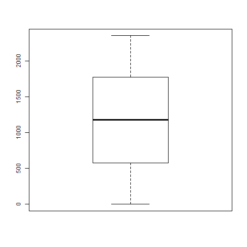

## Loading and preprocessing the data

```r
activity <-read.csv("activity.csv")
```


## What is mean total number of steps taken per day?

```r
boxplot(activity$interval)
```

 


## What is the average daily activity pattern?


## Imputing missing values


## Are there differences in activity patterns between weekdays and weekends?
